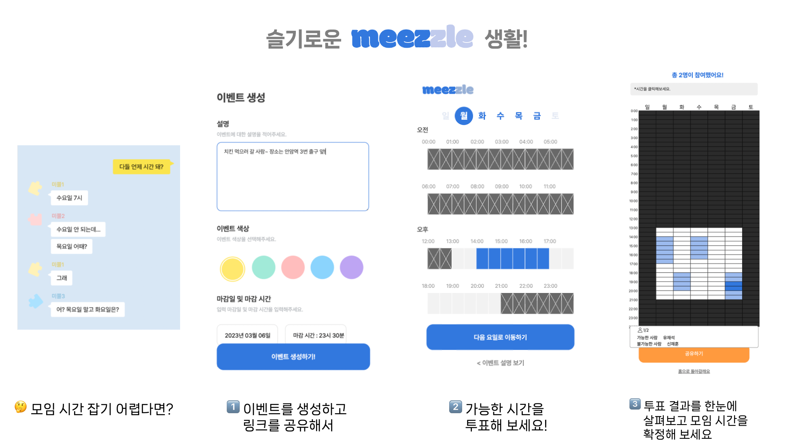
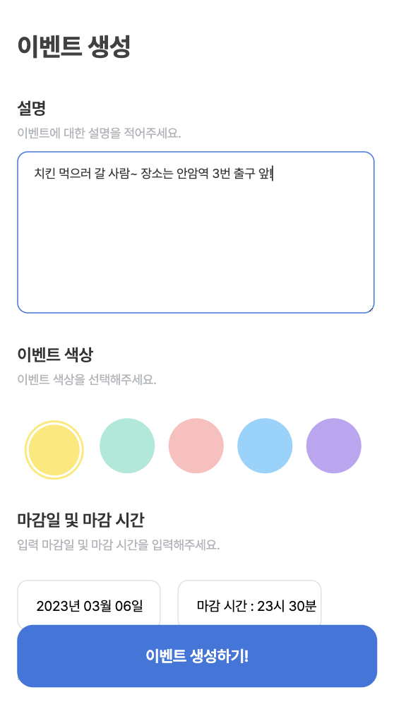
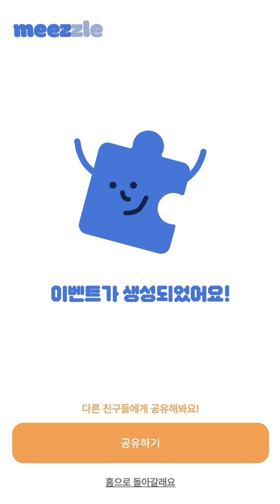
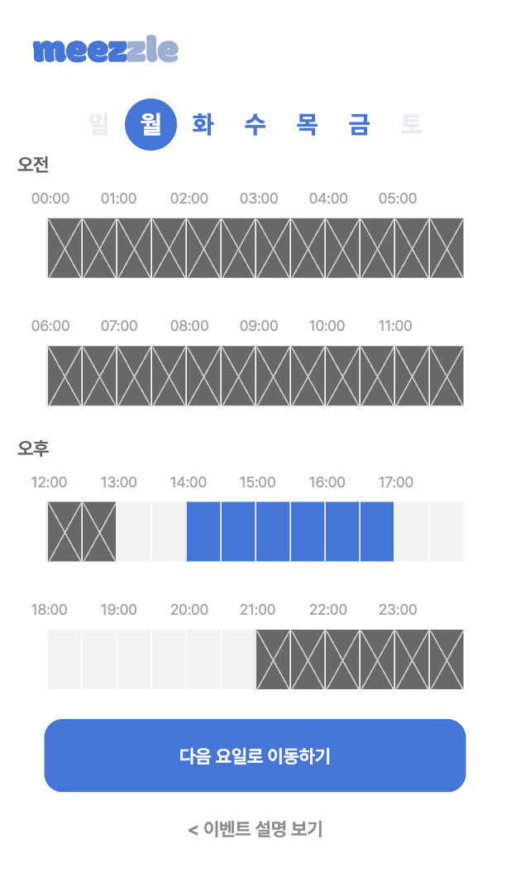
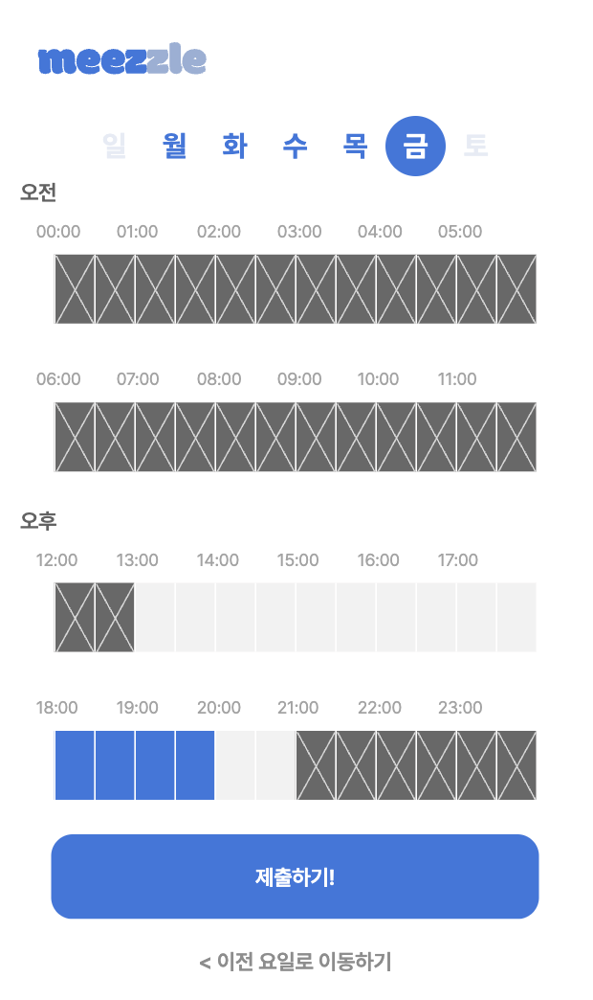
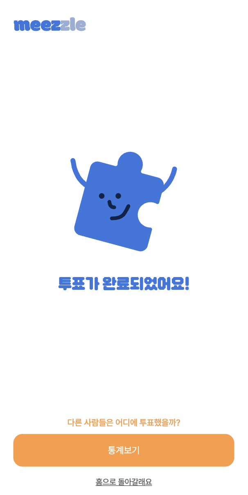
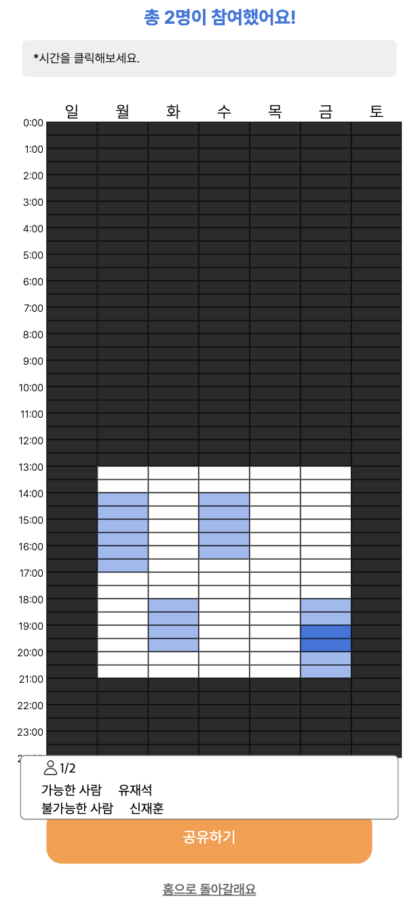

# [meezzle] 약속은 편하게! 모임은 즐겁게!

    
<a href="https://www.meezzle.xyz/"> meezzle </a>
<a> (모바일에서 접속하는 것을 추천드려요😃)</a>

<a href="https://www.meezzle.xyz/event/11edd358-e891-9161-865c-59daa71530f1/info?voter=false"> Test Link </a>
<a> (테스트 링크입니다! 이 링크에서 자유롭게 체험해 보세요!)</a>

## 💡 서비스 소개

> 💡 모바일에서 사용하기 편리한 **모임 시간 투표 서비스**

저희는 모임 시간을 정하는데 들어가는 커뮤니케이션 비용을 줄이고자 meezzle이라는 서비스를 기획했습니다. 기존에 모임시간을 정하기 위해서 많은 시간을 사용하진 않으셨나요? meezzle과 함께라면 쉽고 편하게 모임 시간을 정할 수 있습니다!

### 해결하고 싶었던 문제

1. 모임 시간을 정하는데 `커뮤니케이션 비용`이 많이 들어감
2. 기존의 모임 시간을 정하는 서비스들은 `모바일에서 사용하기 불편함`

### Meezzle의 해결 방안

- **모바일에서 편하게 사용**할 수 있는 UX/UI로 **모임 시간 투표 서비스**를 만들자!

### 서비스 이용 방법

#### 🐯 모임 시간을 정하고 싶은 팀장이라면?

1. 카카오톡 간편 가입을 통해 meezzle에 가입하기
2. 이벤트를 생성하기 (투표하고 싶은 **요일**과 **시간대**를 선택해 보세요)
3. 팀원들에게 **링크를 공유**하기!

#### 🐯 투표 링크를 받은 팀원이라면?

1. 링크에 접속해 자신의 **이름**과 비밀번호(선택)를 입력하기
2. **가능한 시간**을 드레그하여 **투표**하기
3. 제출을 누르면 투표 완료!

## 💡 서비스 기능 소개

### 기능 1. 이벤트 생성

- 이벤트 생성을 통해 투표하고 싶은 요일과 시간대를 설정할 수 있습니다.
- 이벤트 생성 후 공유하기 버튼을 누르면 투표 링크가 복사됩니다.

### 기능 2. 이벤트 투표

- 이벤트를 생성한 유저 뿐만 아니라 투표 링크를 받은 사람들은 누구나 투표를 할 수 있습니다.
- 이벤트에 참여 가능한 요일과 시간을 드레그로 간편하게 선택하고 투표해 보세요!

### 기능 3. 투표 결과 보기

- 이벤트 정보 페이지에서 통계 보기 버튼을 누르면 투표 결과를 한눈에 볼 수 있습니다. 더 많은 사람들이 투표한 시간대일수록 더 짙은 색으로 표시됩니다. 시간을 클릭하면 자세한 투표 정보가 나옵니다 :)

---

## 🧑🏻‍💻 팀 소개

안녕하세요. 저희는 고려대학교 소프트웨어 개발 학회 [DevKor](https://www.notion.so/DevKor-670168c4662a4582b447cfba6f7206f4) 소속 meezzle 팀 입니다. 

### 프론트엔드
#### 🐯 [정경륜 (2nd Team Leader : 2023.02 ~ )](https://ryuni.oopy.io/)
#### 🐯 [신재훈](https://www.notion.so/4c5959e374594c189a47f99b8274c340)

### 백엔드
#### 🐯 [예상오 (1st Team Leader : 2022.08 ~ 2023.02)](https://www.notion.so/8a248ee46ddb4e5eaa980d080e307a7b)

#### 🐯 [윤영로](https://korea-bear-family.notion.site/)
### 디자이너

#### 🐯 박지은

### 기획

#### 🐯 최소정

# 프론트엔드 개발 관련 
* 해당 repository는 meezzle project의 frontend 개발 기록을 담고 있습니다. 
## 진행 중인 작업
- 리팩토링 (여름방학부터 진행 예정)
  - Storybook을 활용한 Component 설계 리팩토링 
  - 이벤트 투표 과정에서 드래그가 좀 더 매끄러워지도록 수정 필요
- 서비스 홍보 
- 추가 기능
  - 요일별 투표가 아닌 날짜별 투표 기능도 필요

## Issue
* 기존 Team repo에서 작업 중이였던 프로젝트를 vercel 무료 이용을 위해 개인 repo로 옮기면서 기존에 있던 PR 기록들이 날아감 (commit 기록은 모두 존재함)

## Stack
* NextJS + Typescript
* Recoil
* React-Query