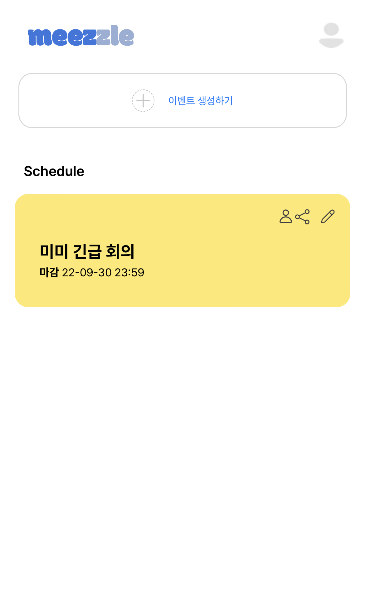
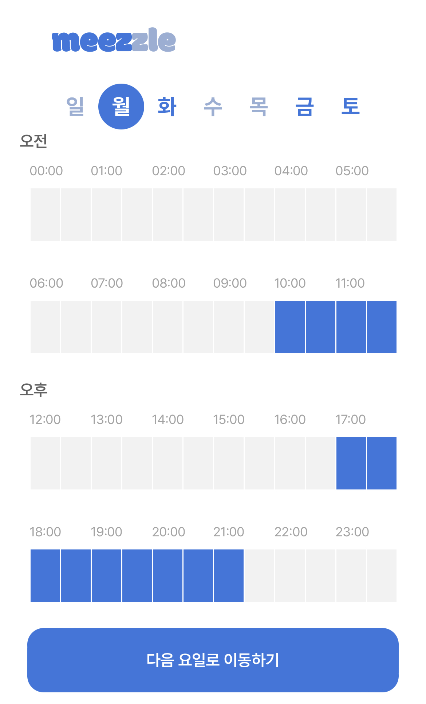

# Meezzle - 우리 몇시에 만날까? (진행 중)
<figure class="half">
    
    
</figure>

## 1. 서비스 소개
### 해결하고 싶었던 문제
1. 모임 시간을 정하는데 `커뮤니케이션 비용`이 많이 들어감
2. 기존의 모임 시간을 정하는 서비스들은 `모바일에서 사용하기 불편함`
### 우리의 해결 방안
* **모바일에서 편하게 사용**할 수 있는 UXUI로 **모임 시간 투표 서비스**를 만들자!

## 2. 프로젝트 진행 상황
### 진행 완료된 사항 (2022년 12월 4일 기준)

  * 기본적인 component 구성 완료
  * Element selection using drag 기능 구현 완료
  * 투표 통계 뷰 기본 구성 완료
  
### 앞으로 진행해야 할 사항

- [ ] 백엔드 서버 연결 작업 
    * 현재 internal server (NextJS API 기능 활용)를 통해 일부 기능 연동 완료된 상황
    * 실제 서버와 연결 작업 아직 미완
- [ ] 랜딩 페이지 구성 
- [ ] 로그인 페이지 구성 (+ 캐치 프라이즈)
    - 현재는 임시 로그인 처리 되어 있으나 서버 연동 작업 하면서 소셜 로그인 도입 예정
- [ ] Guest 로그인 시 검증 과정 추가 필요
- [ ] 통계 뷰 UI 수정
- [ ] QA

## 3. Issue
* 기존 Team repo에서 작업 중이였던 프로젝트를 vercel 무료 이용을 위해 개인 repo로 옮기면서 기존에 있던 PR 기록들이 날아감 (commit 기록은 모두 존재함)

## 4. 기타
* 해당 repository는 meezzle project의 frontend 개발 기록을 담고 있습니다. 