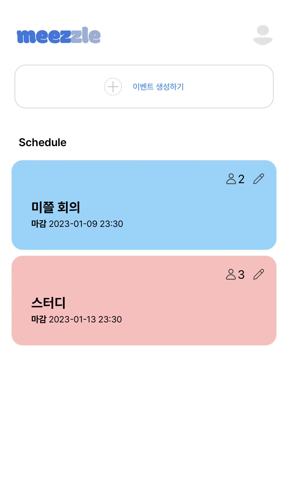
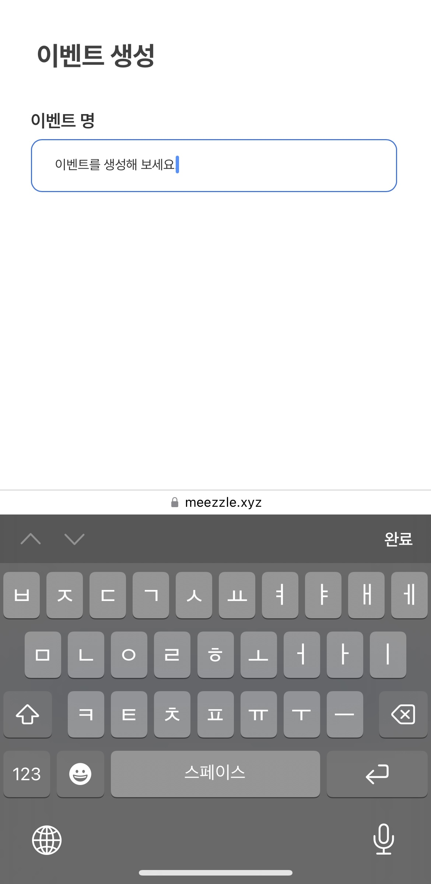
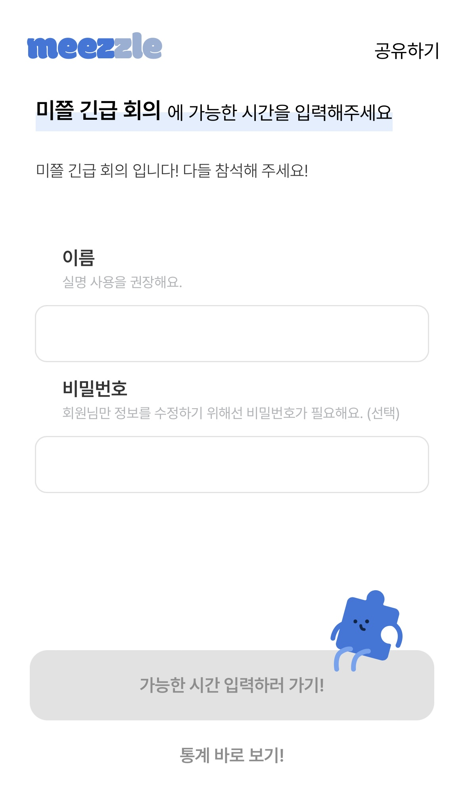
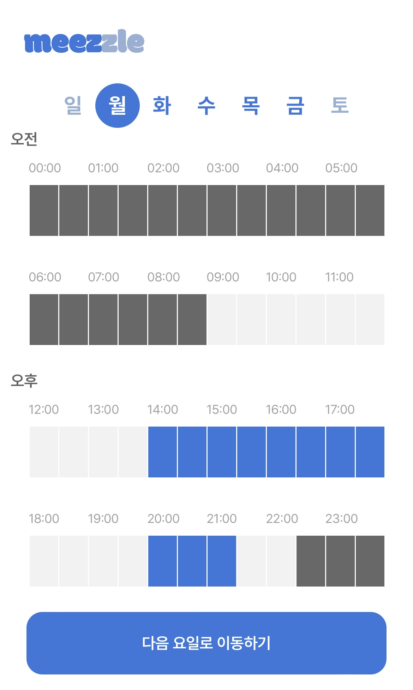
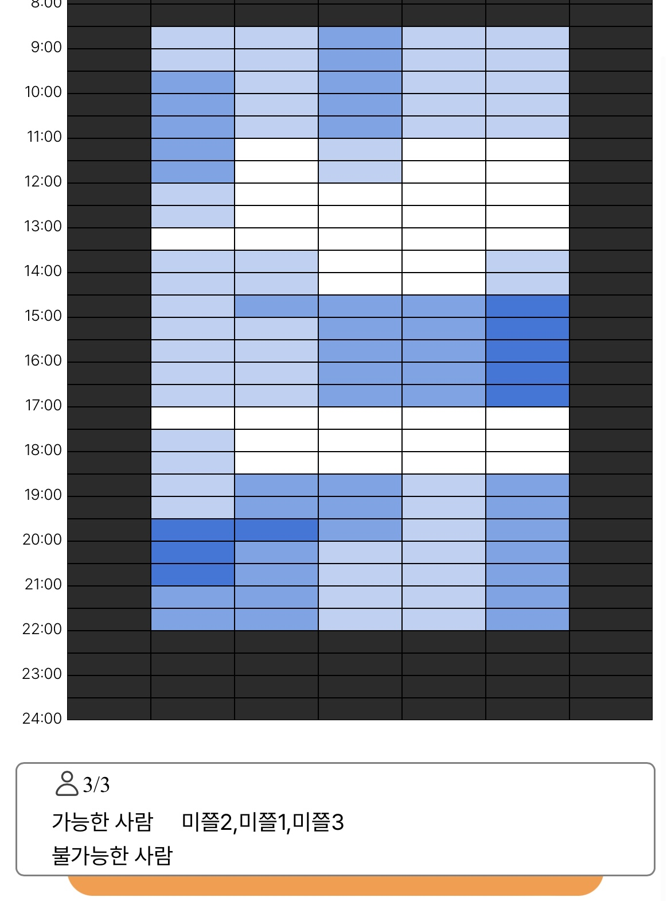

# Meezzle - 우리 몇시에 만날까? (QA 진행 중)

    
<a href="https://meezzle.xyz/"> meezzle </a>
<a> (모바일에서 접속하는 것을 추천드려요😃)</a>

<a>🚨 현재 QA를 진행 중 이에요! (가입해서 사용해 보시고 문제가 발생한다면 issue를 남겨주세요!) </a>

<!-- <a>🚨 개발 완료 후 도메인이 변경될 수 있습니다!</a> -->

    
    
    
    
    
    

## 1. 서비스 소개
### 해결하고 싶었던 문제
1. 모임 시간을 정하는데 `커뮤니케이션 비용`이 많이 들어감
2. 기존의 모임 시간을 정하는 서비스들은 `모바일에서 사용하기 불편함`
### 우리의 해결 방안
* **모바일에서 편하게 사용**할 수 있는 UXUI로 **모임 시간 투표 서비스**를 만들자!

### 간단한 서비스 이용 방법
1. Meezzle에 가입한다. (카카오톡으로 쉽게 회원가입 하기!)
2. 이벤트를 생성한다. (투표하고 싶은 요일과 시간대를 선택해 보세요!)
3. 이벤트 투표 링크를 친구들에게 공유하기!
## 2. 프로젝트 진행 상황
### 진행 완료된 사항 (2023년 1월 12일 기준)

  * ~~기본적인 component 구성 완료~~
  * ~~Element selection using drag 기능 구현 완료~~
  * ~~투표 통계 뷰 기본 구성 완료~~
  * 초기 기획 기능 모두 구현 완료
  * API 연결 완료
  * 현재 QA 진행 중
  
### 앞으로 진행해야 할 사항

- [x] 백엔드 서버 연결 작업 
- [x] 랜딩 페이지 구성 
- [x] 로그인 페이지 구성 (+ 캐치 프라이즈)
- [x] Guest 로그인 시 검증 과정 추가 필요
- [x] 통계 뷰 UI 수정
- [ ] QA
- [ ] 에러 핸들링
- [ ] 테스트 코드 작성
- [ ] 리펙토링
- [ ] 서비스 홍보 

## 3. Issue
* 기존 Team repo에서 작업 중이였던 프로젝트를 vercel 무료 이용을 위해 개인 repo로 옮기면서 기존에 있던 PR 기록들이 날아감 (commit 기록은 모두 존재함)

## 4. Stack
* NextJS + Typescript
* Recoil
* React-Query
## 4. 기타
* 해당 repository는 meezzle project의 frontend 개발 기록을 담고 있습니다. 

